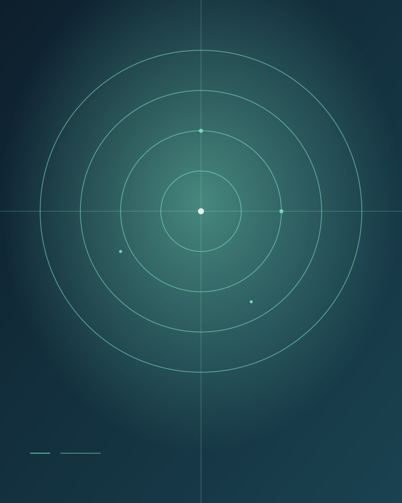
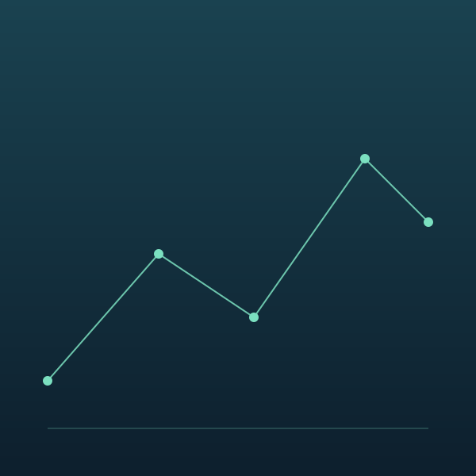

<!-- _class: hero -->
<!-- _paginate: false -->


# 슬라이드 테마 쇼케이스

타이포그래피, 색, 레이아웃 — 같은 콘텐츠를 어떻게 다르게 말할 수 있는가

---

<!-- _class: section -->
<!-- _paginate: false -->

## 01

# Foundations

슬라이드의 기본 단위들 — 제목, 본문, 인용, 강조

---

## 목차

1. Hero & section divider — 분위기 잡기
2. 본문 — 텍스트 + 인용
3. Split & grid — 시각 자료
4. Code & data — 기술 슬라이드
5. 마무리 — 다음 단계

---

<!-- _class: split -->



## 핵심 메시지

테마는 콘텐츠의 톤을 결정합니다. 같은 텍스트라도 타이포그래피와 색이 바뀌면 느낌이 완전히 달라집니다.

본문 단락은 두세 줄이 적당합니다. 청중이 읽기 전에 발표자가 먼저 말을 시작할 수 있을 만큼만.

오른쪽 이미지가 split의 절반을 채우고, 왼쪽에 본문이 흐릅니다.

---

<!-- _class: quote -->

> 좋은 테마는 보이지 않는다.
> 메시지가 먼저 보인다.

— attributed to a designer, somewhere

---

## 기술 슬라이드

런타임에서 `process.env.NODE_ENV` 같은 인라인 코드를 자연스럽게 강조하는지 확인합니다.

```typescript
// 간단한 디바운스 함수
export function debounce<T extends (...args: unknown[]) => void>(
  fn: T,
  delay: number,
): (...args: Parameters<T>) => void {
  let timer: ReturnType<typeof setTimeout> | null = null;
  return (...args) => {
    if (timer) clearTimeout(timer);
    timer = setTimeout(() => fn(...args), delay);
  };
}
```

---

## 데이터 슬라이드

| 지표 | Q3 | Q4 | 변화 |
|---|---:|---:|---:|
| 활성 사용자 | 12,400 | 18,200 | +47% |
| 전환율 | 2.1% | 3.4% | +1.3pt |
| 평균 세션 | 4m 12s | 5m 03s | +20% |
| NPS | 38 | 46 | +8 |

표가 슬라이드 폭을 자연스럽게 채우는지, 헤더 강조가 적절한지 봅니다.

---

<!-- _class: stat -->

# +47%

## QoQ 활성 사용자 성장

12.4K → 18.2K, 전환율과 NPS가 함께 오르며 견인.

---

<!-- _class: grid -->

## 시각 자료 — 3-up

  

이미지 카드를 가로로 배치 — 간격, 정렬, 비율 확인.

---

## 마무리

- 인쇄와 화면 양쪽에서 가독성이 유지되는지 확인
- 코드 블록과 표의 시각적 위계가 분명한지 확인
- 색 대비가 접근성 기준을 만족하는지 확인

이 쇼케이스가 선명하게 보이면, 일반적인 발표 자료에서도 잘 작동합니다.
